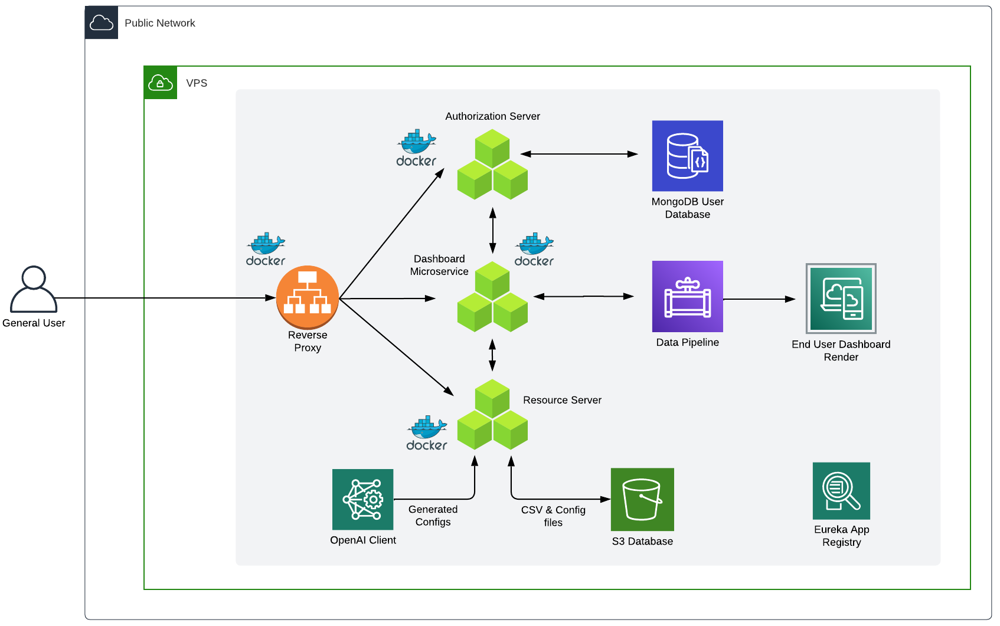

# Welcome to Dash Analytics

## Description

Welcome to Dash Analytics, where you can visualize your data with ZERO code or data skills. To see this website in production, visit [Dash Analytics](https://dash-analytics.solutions).
To watch a tour of our platform and software, visit [Dash Analytics Walkthrough](https://drive.google.com/file/d/1zZvENRDF7NT1CA_EdQQcoAjzv-7bfd37/view?usp=drivesdk).

## How to Use

1. Sign up by making an account with Dash Analytics or by logging in with your Google account (coming soon)
2. After logging in, you can navigate to the [dashboards](https://dash-analytics.solutions/dashboards) page.
3. Once on your dashboard page, you can view previous projects or create a new one by uploading a CSV and providing the necessary context for us to generate all the visualizations you need!

## Frontend Installation

To run a local copy of this project:

1. Clone the repository

```
git clone https://github.com/Dash-CS370/dash-analytics.git
```

2. Navigate to the dash-frontend directory & install the latest packages

```bash
cd dash-frontend
yarn install
# or
npm install
```

3. Start the development server to see a local version of the dash frontend

```bash
yarn dev
# or
npm run dev
```

4. To view your local front end, visit [http://localhost:3000](http://localhost:3000).

## Backend Installation
To run the backend, we need to start 4 different Springboot Microservices in the order given below:
These microservices are found in the `/Dash-backend/` directory at the root of the project. 
Since this is a Maven-based project, the JAR files are typically generated in each microservice's `target` folder. 
Before you start, ensure you've run the Maven build process to create these JAR files
using the following commands:

```bash
   cd /Dash-backend/Eureka-Server/
   mvn clean install
```
```bash
   cd /Dash-backend/OAuthorization-Server/
   mvn clean install
```
```bash
   cd /Dash-backend/Resource-Server/
   mvn clean install
```
```bash
   cd /Dash-backend/Dashboard-Service/
   mvn clean install
```


1. **Eureka Server**
   - **Description**: Eureka is a service discovery server. It helps other microservices discover each other and maintain their registration.
   - **Startup Command**: 
     ```bash
     cd /Dash-backend/Eureka-Server/target
     java -jar Eureka-Server.jar
     ```

2. **OAuth Authorization Server**
   - **Description**: This service handles user authentication and issues OAuth tokens for authorized access to other services.
   - **Startup Command**:
     ```bash
     cd /Dash-backend/OAuthorization-Server/target
     java -jar OAuthorization-Server.jar
     ```

3. **Resource Server**
   - **Description**: The resource server provides protected resources to authenticated clients based on OAuth tokens.
   - **Startup Command**:
     ```bash
     cd /Dash-backend/Resource-Server/target
     java -jar Resource-Server.jar
     ```

4. **Dashboard Service**
   - **Description**: The dashboard service is the central service for which the resources and authentication is handled through in this ecosystem.
   - **Startup Command**:
     ```bash
     cd /Dash-backend/Dashboard-Service/target
     java -jar Dashboard-Service.jar
     ```

## Notes
- Make sure the TCP ports 8080, 8081, 9000, and 8761 are not occupied before running these commands.
- To ensure proper communication between servers, add an alias for `127.0.0.1` in `hosts.conf`:
  ```bash
  echo "127.0.0.1 auth-server" | sudo tee -a /etc/hosts
<br>

## Project Architecture


<br>

## Learn More

To learn more about this project, visit our [website](https://dash-analytics.solutions) or contact one of the team members below:

- Justin Lurie: justin.lurie@emory.edu
- George Morales: george.morales@emory.edu
- Jason Lebov: jason.lebov@emory.edu
- Vera Wen: vera.wen@emory.edu
- Kevin Hou: khou6@emory.edu
- Tim McGarry: tim.mcgarry@emory.edu
